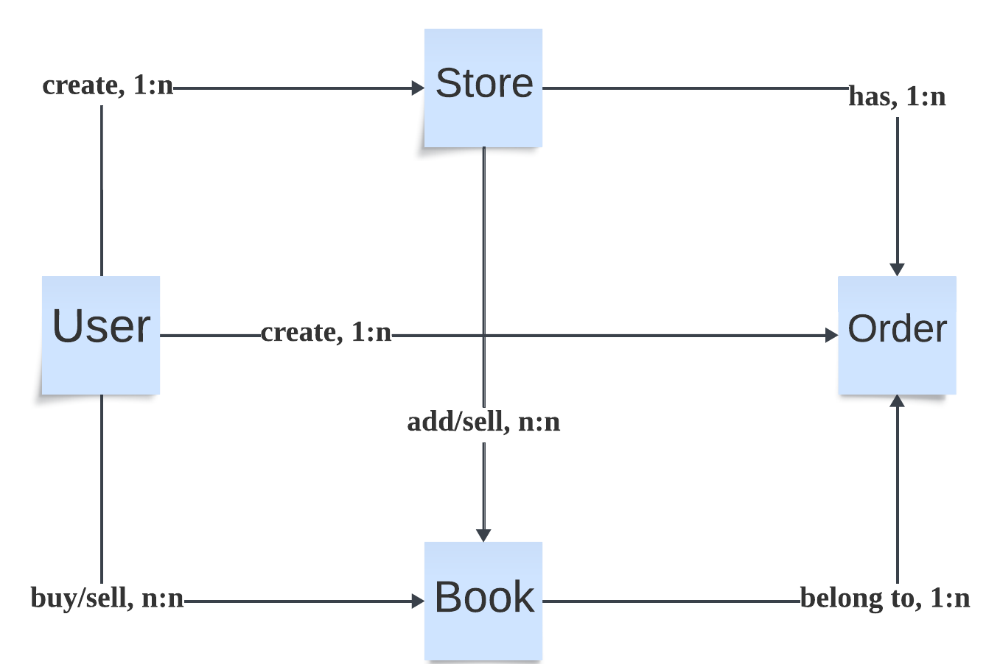

# 当代数据管理系统 项目报告1

## 成员与分工

| 学号        | 姓名    | 分工                                                                |
| ----------- | ------- | ------------------------------------------------------------------- |
| 10205501432 | 温兆和  | 把用户权限接口、买家用户接口和卖家用户接口改写成MongoDB形式、增加图书搜索功能 |
| 10215501429 | 刘永哲  | 把`book.db`中的数据迁移至本地MongoDB数据库、增加发货、收货、订单状态查询、取消订单功能 |

以上表格按照学号从小到大的顺序从上到下排序。开发过程中，我们两人各自在`fe/test`中编写了各自实现的功能的测试用例并对代码的正确性进行了测试。


## 文档数据库设计
在这个课程项目中，我们在`bookstore1`这个MongoDB文档数据库里构建了八个文档集合。它们分别是：
| 文档集合名称    | 可能用到的属性    | 作用                                     |
| ------------------- | ------------------- | ---------------------------------------- |
| `user`                    | `user_id`,`password`,`balance`,`token`,`terminal`               | 存放用户的ID、密码、余额、登陆状态等信息 |
| `user_store`         | `user_id`,`store_id`                                                             | 存放卖家开店信息                         |
| `store`                  | `store_id`,`book_id`,`book_info`,`stock_level`                 | 存放各个店铺中的书籍信息和每本书的存量 |
| `new_order`        | `order_id`,`user_id`,`store_id`                                     | 存放新订单的订单主体（买家、卖家）       |
| `order_history` | `order_id`,`user_id`,`store_id`                                     | 存放历史订单的订单主体（买家、卖家）    |
| `new_order_detail` | `order_id`,`user_id`,`store_id`                                 | 存放新订单的细节（买了哪本书，购买数量，价格） |
| `order_history_detail` | `order_id`,` book_id`,`count`,`price`               | 存放历史订单的细节（买了哪本书，购买数量，价格） |
| `books`               | `id`,`title`,`author`,`publisher`,`original_title`,`translator`,`pub_year`,`pages`,`price`,`currency_unit`,`binding`,`isbn`,`author_intro`,`book_intro`,`content`,`tags`,`picture` | 存放书籍信息 |

本次课程项目的文档数据库schema如下：


## 接口实现细节

在这个项目中，不论是什么接口，它的大致流程无非就是这样：前端（路径：`fe/access`）首先产生一个请求，然后`be/view`中的接口识别和接收这些请求并发送给`be/model`中的相应函数，这些函数会对数据库进行操作并返回结果。以“用户注册”功能为例，`fe/access/auth.py`中的`register()`函数首先把用户设置的用户ID和密码塞进请求体并发起一个POST请求，然后`be/view/auth.py`中的`register()`函数会根据路径`"/register"`识别并接收前端的注册请求，把请求体中的用户ID和密码解析出来并发给`be/model/user.py`中的`register()`函数，由它来执行注册过程中的数据库操作。其他功能的前后端逻辑也类似。下面逐一分析各个接口数据库操作的实现细节和测试用例的功能。

### 用户注册

用户注册的后端代码位于`be/model/user.py`的`register()`函数中。首先，查找文档集合`user`中是否已经存在相同的用户ID，如果有就报错：
```Python
	existing_user = self.conn['user'].find_one({"user_id": user_id})
	if existing_user:
            # If user with the same user_id exists, return an error
            return error.error_exist_user_id(user_id)
```
否则，就把用户的ID、密码、余额等信息保存进文档集合`user`中。最终，如果MongoDB数据库出现错误就返回528错误码，如何成功注册就返回200。
```Python
        try:
            terminal = "terminal_{}".format(str(time.time()))
            token = jwt_encode(user_id, terminal)
            user_doc = {
                "user_id": user_id,
                "password": password,
                "balance": 0,
                "token": token,
                "terminal": terminal
            }
            self.conn['user'].insert_one(user_doc)
        except pymongo.errors.PyMongoError as e:
            return 528, str(e)
        return 200, "ok"
```
这个功能共有`test_register_ok`和`test_register_error_exist_user_id`两个测试用例。其中，前者用来测试基本的注册功能是否正常，后者用来测试当我们注册一个已经被使用过的用户ID时会不会报错。

### 用户登录
用户登录的后端代码位于`be/model/user.py`的`login()`函数中。首先，我们检查用户输入的密码是否正确，如果用户不存在或密码不正确就报错：
```Python
	code, message = self.check_password(user_id, password)
    if code != 200:
    	return code, message, ""
```
否则，在文档集合`user`中修改相应用户的`token`和`terminal`属性，如果修改失败就报错：
```Python
token = jwt_encode(user_id, terminal)
            result = self.conn['user'].update_one({'user_id': user_id}, {'$set': {'token': token, 'terminal': terminal}})
            if result.matched_count == 0:
                return error.error_authorization_fail() + ("",)
```

用户登录的测试用例有`test_ok`、`test_error_user_id`和`test_error_password`。其中，`test_ok`用来测试基本的登录功能是否正常，`test_error_user_id`和`test_error_password`分别用来测试当我们输入错误的用户名或者错误的密码时系统会不会报出相应的错误。

### 用户登出
用户登出的后端代码位于`be/model/user.py`的`logout()`函数中。首先，检查用户是否处于登陆状态中，如果不是则报错：
```Python
	code, message = self.check_token(user_id, token)
    if code != 200:
    	return code, message
```
否则，在文档集合`user`中修改相应用户的`token`和`terminal`属性，如果修改失败就报错：
```Python
terminal = "terminal_{}".format(str(time.time()))
            dummy_token = jwt_encode(user_id, terminal)

            result = self.conn['user'].update_one({'user_id': user_id}, {'$set': {'token': dummy_token, 'terminal': terminal}})
            if result.matched_count == 0:
                return error.error_authorization_fail()
```

### 用户注销
用户注销的后端代码位于`be/model/user.py`的`unregister()`函数中。首先，检查用户是否存在、密码是否正确，如果不是就报错：
```Python
	code, message = self.check_password(user_id, password)
    if code != 200:
    	return code, message
```
否则，就从文档集合`user`中删除相应的用户，如果删除失败则报错：
```Python
	result = self.conn['user'].delete_one({'user_id': user_id})
    if result.deleted_count != 1:
    	return error.error_authorization_fail()
```
用户注销的测试用例包括`test_unregister_ok`和`test_unregister_error_authorization`。其中，前者用于检查用户是否能正常注销，后者用于检查当注销的用户不存在或者密码不正确时系统是否会报错。

### 买家充值
买家充值的后端代码位于`be/model/buyer.py`的`add_funds()`函数中。首先，在文档集合`user`中找到买家。如果买家的用户ID不存在或者输入的密码不正确都要报错：
```Python
	user = self.conn["user"].find_one({"user_id": user_id})
    if not user:
    	return error.error_authorization_fail()

    if user["password"] != password:
    	return error.error_authorization_fail()
```
否则，就在文档集合`user`中修改相应用户的余额值，如果修改失败也要报错：
```Python
	result = self.conn["user"].update_one(
                {"user_id": user_id},
                {"$inc": {"balance": add_value}}
            )
            if result.modified_count == 0:
                return error.error_non_exist_user_id(user_id)
```
买家充值的测试用例有`test_ok`、`test_error_user_id`和`test_error_password`。其中，`test_ok`用于检查买家充值的基本功能是否正确实现，`test_error_user_id`和`test_error_password`则分别用于测试当用户名不存在或者密码错误时系统是否会报出相应错误。

### 买家下单
买家下单的后端代码位于`be/model/buyer.py`的`new_order()`函数中。首先，如果买家用户ID或者商店的ID不存在，都要报错：
```Python
            if not self.user_id_exist(user_id):
                return error.error_non_exist_user_id(user_id) + (order_id,)
            if not self.store_id_exist(store_id):
                return error.error_non_exist_store_id(store_id) + (order_id,)
```
然后，从文档集合`store`中搜素店铺中是否有买家想要的图书。如果没有相应图书或者图书存量少于顾客需求，都要报错：
```Python
uid = "{}_{}_{}".format(user_id, store_id, str(uuid.uuid1()))

            order = {"order_id": uid, "user_id": user_id, "store_id": store_id}

            order_details = []
            for book_id, count in id_and_count:
                book = self.conn["store"].find_one({"store_id": store_id, "book_id": book_id})
                if not book:
                    return error.error_non_exist_book_id(book_id) + (order_id,)
                stock_level = book["stock_level"]
                if stock_level < count:
                    return error.error_stock_level_low(book_id) + (order_id,)
```
然后，把文档集合`store`中相应图书在店铺中的存量减去顾客购买图书的数量。如果修改不成功，系统报错：
```Python
result = self.conn["store"].update_one(
                    {"store_id": store_id, "book_id": book_id, "stock_level": {"$gte": count}},
                    {"$inc": {"stock_level": -count}}
                )
                if result.modified_count == 0:
                    return error.error_stock_level_low(book_id) + (order_id,)
```
随后，计算价格，把订单存入`new_order`文档集合，把订单细节存入`new_order_detail`文档集合：
```Python
# 计算价格
                book_info = json.loads(book["book_info"])
                price = book_info.get("price")
                order_detail = {
                    "order_id": uid,
                    "book_id": book_id,
                    "count": count,
                    "price": price
                }
                order_details.append(order_detail)

            # 插入订单详情
            if order_details:
                self.conn["new_order_detail"].insert_many(order_details)

            # 插入订单
            self.conn["new_order"].insert_one(order)
            order_id = uid
```
如果订单超过一定时间没有被支付就会被取消并存入历史订单中：
```Python
# 延迟队列

            timer = threading.Timer(60.0, self.cancel_order, args=[user_id, order_id])
            timer.start()

            # 存入历史订单
            order["status"] = "pending"
            self.conn["order_history"].insert_one(order)
            self.conn["order_history_detail"].insert_many(order_details)
```
买家下单有五个测试用例。其中，`test_ok`用来测试基本的下单功能是否正常，`test_non_exist_user_id`和`test_non_exist_store_id`用来测试当用户ID或者店铺不存在时系统是否会报错，`test_non_exist_book_id`和`test_low_stock_level`用来测试当店铺中没有该书籍或者店铺中相应书籍库存少于用户需求时系统是否会报错。

### 买家付款
买家付款的后端代码位于`be/model/buyer.py`的`payment()`函数中。首先，如果`new_order`这个文档集合中不存在这笔订单，系统就报错：
```Python
order = conn["new_order"].find_one({"order_id": order_id})
            if not order:
                return error.error_invalid_order_id(order_id)
```
一笔订单只能由它的买家来支付。如果买家不存在或者与订单上的买家不匹配，就要报错：
```Python
buyer_id = order["user_id"]
            store_id = order["store_id"]

            if buyer_id != user_id:
                return error.error_authorization_fail()

            buyer = conn["user"].find_one({"user_id": buyer_id})
            if not buyer:
                return error.error_non_exist_user_id(buyer_id)
            balance = buyer["balance"]
            if password != buyer["password"]:
                return error.error_authorization_fail()
```
店铺的店主需要接收付款。如果商店不存在或者商店的店主不在文档集合`user`中，也要报错：
```Python
store = conn["user_store"].find_one({"store_id": store_id})
            if not store:
                return error.error_non_exist_store_id(store_id)

            seller_id = store["user_id"]

            if not self.user_id_exist(seller_id):
                return error.error_non_exist_user_id(seller_id)
```
接着，计算订单价格，如果价格大于买家的余额，就报错：
```Python
order_details = conn["new_order_detail"].find({"order_id": order_id})
            total_price = 0

            for detail in order_details:
                count = detail["count"]
                price = detail["price"]
                total_price += price * count

            if balance < total_price:
                return error.error_not_sufficient_funds(order_id)
```
然后，买家的余额减去价格，卖家的余额加上价格，如果修改不成功就报错：
```Python
result = conn["user"].update_one(
                {"user_id": buyer_id, "balance": {"$gte": total_price}},
                {"$inc": {"balance": -total_price}}
            )
            if result.modified_count == 0:
                return error.error_not_sufficient_funds(order_id)

            result = conn["user"].update_one(
                {"user_id": seller_id},
                {"$inc": {"balance": total_price}}
            )
            if result.modified_count == 0:
                return error.error_non_exist_user_id(buyer_id)
```
完成付款后，从“新订单”中删除该订单，往“历史订单”中加入该订单：
```Python
result = conn["new_order"].delete_one({"order_id": order_id})
            if result.deleted_count == 0:
                return error.error_invalid_order_id(order_id)

            result = conn["new_order_detail"].delete_many({"order_id": order_id})
            if result.deleted_count == 0:
                return error.error_invalid_order_id(order_id)

            result = conn["order_history"].update_one(
                {"order_id": order_id},
                {"$set": {"status": "paid"}}
            )
            if result.modified_count == 0:
                return error.error_invalid_order_id(order_id)
```
买家付款有四个测试用例。其中，`test_ok`用于测试基本的付款功能是否实现，`test_authorization_error`用于监测系统是否能排除订单上的买家用户ID与付款者不匹配的情况，`test_not_suff_funds`检查当买家余额不足时系统是否会报错，`test_repeat_pay`用于检测完成付款后订单是否会从“新订单”中删除。

### 卖家创建店铺
卖家创建店铺的后端代码位于`be/model/seller.py`的`create_store()`函数中。如果卖家的用户ID不存在或者店铺已经存在，系统报错：
```Python
            if not self.user_id_exist(user_id):
                return error.error_non_exist_user_id(user_id)
            if self.store_id_exist(store_id):
                return error.error_exist_store_id(store_id)
```
否则，就把卖家用户ID和店铺ID插入文档集合`user_store`中：
```Python
user_store_doc = {
                'store_id': store_id,
                'user_id': user_id,
            }
            self.conn['user_store'].insert_one(user_store_doc)
```
卖家创建店铺有`test_ok`和`test_error_exist_store_id`两个测试用例。其中，前者注册一个新用户并让这个用户创建一个店铺，用于测试接口的基本功能；后者在创建一个店铺后再创建一次同一个店铺，用于测试创建已经存在的店铺时系统是否会报错。

### 卖家在店铺中添加书籍信息
卖家在店铺中添加书籍信息的后端代码位于`be/model/seller.py`的`add_book()`函数中。首先，卖家、店铺、需要添加的图书都必须存在，否则系统报错：
```Python
            if not self.user_id_exist(user_id):
                return error.error_non_exist_user_id(user_id)
            if not self.store_id_exist(store_id):
                return error.error_non_exist_store_id(store_id)
            if self.book_id_exist(store_id, book_id):
                return error.error_exist_book_id(book_id)
```
随后，把店铺信息、图书信息和卖家设置的库存数量插入到文档集合`store`中：
```Python
book_doc = {
                'store_id': store_id,
                'book_id': book_id,
                'book_info': book_json_str,
                'stock_level': stock_level,
            }
            self.conn['store'].insert_one(book_doc)
```
这个接口共有四个测试用例，其中`test_ok`用于测试接口基本功能，`test_error_non_exist_store_id`、`test_error_exist_book_id`和`test_error_non_exist_user_id`分别用于测试店铺、书籍或者卖家不存在时系统是否会报错。

### 卖家增加库存
卖家增加库存的后端代码位于`be/model/seller.py`的`add_stock_level()`函数中。首先，卖家、店铺、需要添加的图书都必须存在，否则系统报错：
```Python
            if not self.user_id_exist(user_id):
                return error.error_non_exist_user_id(user_id)
            if not self.store_id_exist(store_id):
                return error.error_non_exist_store_id(store_id)
            if self.book_id_exist(store_id, book_id):
                return error.error_exist_book_id(book_id)
```
然后，在文档集合`store`中修改相应图书的库存数量：
```Python
self.conn['store'].update_one(
                {'store_id': store_id, 'book_id': book_id},
                {'$inc': {'stock_level': add_stock_level}},
            )
```
卖家增加库存共有四个测试用例，其中`test_ok`用于测试接口基本功能，`test_error_non_exist_store_id`、`test_error_exist_book_id`和`test_error_non_exist_user_id`分别用于测试店铺、书籍或者卖家不存在时系统是否会报错。

### 用户搜索图书
用户搜索图书后端代码位于`be/model/user.py`的`search_book()`函数中。这个函数共有`title`、`content`、`tag`和`store_id`四个输入，其中前三个分别对应标题、内容和标签三个查询属性：
```Python
query = {}

            if title:
                query['title'] = {"$regex": title}
            if content:
                query['content'] = {"$regex": content}
            if tag:
                query['tags'] = {"$regex": tag}
```
第四个`store_id`如果为空代表全站搜索，否则就在相应的店铺内搜索。如果是店内搜索，就要从`store`文档集合中搜索出所有`book_id`，并规定只有出现在这些`book_id`中的书籍才能被筛选入查询结果。
```Python
            if store_id:
                # 查询 store 集合，获取指定 store_id 下的所有 book_id
                store_query = {"store_id": store_id}
                store_result = list(self.conn["store"].find(store_query))
                if len(store_result) == 0:
                    return error.error_non_exist_store_id(store_id)
                book_ids = [item["book_id"] for item in store_result]
                # 添加 book_id 到查询条件
                query['id'] = {"$in": book_ids}
```
最后，执行查询即可。如果成功搜索到结果，就返回200，如果搜索结果为空就返回错误码529，如果系统出现故障就返回528.
```Python
results = list(self.conn["books"].find(query))
        except pymongo.errors.PyMongoError as e:
            return 528, str(e)
        except BaseException as e:
            return 530, "{}".format(str(e))
        if not results:
            return 529, "No matching books found."
        else:
            return 200, "ok"
```
我们为搜索书籍的接口写了五个测试用例，其中`test_search_global`测试全站搜索是否正常，`test_search_global_not_exists`测试如果被搜索的书籍在`books`文档集合中压根不存在系统是否会报错，`test_search_in_store`测试在特定店铺中搜索的功能是否正常，`test_search_not_exist_store_id`测试如果我们在一个根本不存在的商店里搜索书籍会不会报出相应错误，`test_search_in_store_not_exist`则找到一本在文档集合`books`中存在，但是在用户要搜索的店铺中不存在的书籍，看看店内搜索时搜索结果是否为空。值得注意的是，上述每个测试用例都测试了`title`、`content`和`tag`为空或者不为空的各种组合，以`test_search_global`为例：
```Python
    def test_search_global(self):
        for b in self.books:
            test_title = b.title
            test_content = b.content.split("\n")[0]
            test_tag = b.tags[random.randint(0,len(b.tags)-1)]
            assert self.auth.search_book(title=test_title) == 200
            assert self.auth.search_book(content=test_content) == 200
            assert self.auth.search_book(tag=test_tag) == 200
            assert self.auth.search_book(title=test_title, content=test_content) == 200
            assert self.auth.search_book(title=test_title, tag=test_tag) == 200
            assert self.auth.search_book(content=test_content, tag=test_tag) == 200
            assert self.auth.search_book(title=test_title, content=test_content, tag=test_tag) == 200
```

### 订单查询

首先实现的是订单查询功能，在用户添加订单的时候就将订单信息加入到order_history和order_history_detail这两张表中，调用get_order_history方法向这两张表中查询用户对应的历史订单信息

先创建订单并付款，这样得到历史订单记录，测试用例分别是输入正确用户id和不存在的用户id

### 订单状态

订单状态有以下几类：pending（已下单待付款），paid（已付款待发货），shipped（已发货待收货），received（已收货），cancelled（已取消）。作为order_history的一个属性，在new_order中没有此属性因为new_order默认是已下单待付款

在买家下单时，添加到order_history，设置状态为pending；买家付款时，将对应订单在order_history中的状态置为paid；卖家发货时，置为shipped；买家收货时，置为received；买家可以在付款前取消订单，置为cancelled

对于订单状态的测试在取消订单和发货收货测试中实现

### 取消订单

买家取消订单调用cancel_order方法时，将new_order和new_order_detail中的对应订单信息删除，并将order_history中对应订单的状态更新为cancelled

关于自动取消订单，则是在创建订单时创建一个子线程在60秒后执行cancel_order方法，选择60秒为了方便测试，时间太短会导致测试时订单被提前删除

在测试前，买家创建两个订单，对其中一个进行付款

取消未付款订单，返回200；错误用户id或订单id，返回!200；重复取消，先返回200，再返回!200；取消已付款订单，其实和错误订单id一样，因为已经从new_order删除了，返回!200；长时未付款订单自动取消，先等待61秒，取消订单，返回!200

### 发货收货

卖家发货，如果订单状态为paid，则可以正常发货，并将订单状态更新为shipped

买家收货，如果订单状态为shipped，则可以正常收货，并将订单状态更新为received

在测试前，买家创建两个订单，对其中一个进行付款

发货已付款订单，返回200；先发货在收货，返回200；错误商店id，订单id，买家id，卖家id，返回!200；重复发货或者收货，返回!200；发货未付款订单，返回!200；收货未发货订单，返回!200

### 测试结果
```shell
HUAWEI@LAPTOP-DS4SHQ0N MINGW64 /d/当代数据管理系统/project 1/bookstore
$ bash script/test.sh
===================================================================================== test session starts ======================================================================================
platform win32 -- Python 3.10.4, pytest-7.4.2, pluggy-1.3.0 -- C:\Users\HUAWEI\venv\Scripts\python.exe
cachedir: .pytest_cache
rootdir: D:\当代数据管理系统\project 1\bookstore
collecting ... frontend begin test
collected 56 items

fe/test/test_add_book.py::TestAddBook::test_ok PASSED                                                                                                                                     [  1%]
fe/test/test_add_book.py::TestAddBook::test_error_non_exist_store_id PASSED                                                                                                               [  3%]
fe/test/test_add_book.py::TestAddBook::test_error_exist_book_id PASSED                                                                                                                    [  5%]
fe/test/test_add_book.py::TestAddBook::test_error_non_exist_user_id PASSED                                                                                                                [  7%]
fe/test/test_add_funds.py::TestAddFunds::test_ok PASSED                                                                                                                                   [  8%]
fe/test/test_add_funds.py::TestAddFunds::test_error_user_id PASSED                                                                                                                        [ 10%]
fe/test/test_add_funds.py::TestAddFunds::test_error_password PASSED                                                                                                                       [ 12%]
fe/test/test_add_stock_level.py::TestAddStockLevel::test_error_user_id PASSED                                                                                                             [ 14%]
fe/test/test_add_stock_level.py::TestAddStockLevel::test_error_store_id PASSED                                                                                                            [ 16%]
fe/test/test_add_stock_level.py::TestAddStockLevel::test_error_book_id PASSED                                                                                                             [ 17%]
fe/test/test_add_stock_level.py::TestAddStockLevel::test_ok PASSED                                                                                                                        [ 19%]
fe/test/test_bench.py::test_bench PASSED                                                                                                                                                  [ 21%]
fe/test/test_cancel_order.py::TestCancelOrder::test_ok PASSED                                                                                                                             [ 23%]
fe/test/test_cancel_order.py::TestCancelOrder::test_wrong_user_id PASSED                                                                                                                  [ 25%]
fe/test/test_cancel_order.py::TestCancelOrder::test_non_exist_order_id PASSED                                                                                                             [ 26%]
fe/test/test_cancel_order.py::TestCancelOrder::test_repeat_cancel PASSED                                                                                                                  [ 28%]
fe/test/test_cancel_order.py::TestCancelOrder::test_cancel_paid_order PASSED                                                                                                              [ 30%]
fe/test/test_cancel_order.py::TestCancelOrder::test_cancel_long_time_order PASSED                                                                                                         [ 32%]
fe/test/test_create_store.py::TestCreateStore::test_ok PASSED                                                                                                                             [ 33%]
fe/test/test_create_store.py::TestCreateStore::test_error_exist_store_id PASSED                                                                                                           [ 35%]
fe/test/test_get_order_history.py::TestGetOrderHistory::test_ok PASSED                                                                                                                    [ 37%]
fe/test/test_get_order_history.py::TestGetOrderHistory::test_non_exist_user_id PASSED                                                                                                     [ 39%]
fe/test/test_login.py::TestLogin::test_ok PASSED                                                                                                                                          [ 41%]
fe/test/test_login.py::TestLogin::test_error_user_id PASSED                                                                                                                               [ 42%]
fe/test/test_login.py::TestLogin::test_error_password PASSED                                                                                                                              [ 44%]
fe/test/test_new_order.py::TestNewOrder::test_non_exist_book_id PASSED                                                                                                                    [ 46%]
fe/test/test_new_order.py::TestNewOrder::test_low_stock_level PASSED                                                                                                                      [ 48%]
fe/test/test_new_order.py::TestNewOrder::test_ok PASSED                                                                                                                                   [ 50%]
fe/test/test_new_order.py::TestNewOrder::test_non_exist_user_id PASSED                                                                                                                    [ 51%]
fe/test/test_new_order.py::TestNewOrder::test_non_exist_store_id PASSED                                                                                                                   [ 53%]
fe/test/test_password.py::TestPassword::test_ok PASSED                                                                                                                                    [ 55%]
fe/test/test_password.py::TestPassword::test_error_password PASSED                                                                                                                        [ 57%]
fe/test/test_password.py::TestPassword::test_error_user_id PASSED                                                                                                                         [ 58%]
fe/test/test_payment.py::TestPayment::test_ok PASSED                                                                                                                                      [ 60%]
fe/test/test_payment.py::TestPayment::test_authorization_error PASSED                                                                                                                     [ 62%]
fe/test/test_payment.py::TestPayment::test_not_suff_funds PASSED                                                                                                                          [ 64%]
fe/test/test_payment.py::TestPayment::test_repeat_pay PASSED                                                                                                                              [ 66%]
fe/test/test_register.py::TestRegister::test_register_ok PASSED                                                                                                                           [ 67%]
fe/test/test_register.py::TestRegister::test_unregister_ok PASSED                                                                                                                         [ 69%]
fe/test/test_register.py::TestRegister::test_unregister_error_authorization PASSED                                                                                                        [ 71%]
fe/test/test_register.py::TestRegister::test_register_error_exist_user_id PASSED                                                                                                          [ 73%]
fe/test/test_search.py::TestSearch::test_search_global PASSED                                                                                                                             [ 75%]
fe/test/test_search.py::TestSearch::test_search_global_not_exists PASSED                                                                                                                  [ 76%]
fe/test/test_search.py::TestSearch::test_search_in_store PASSED                                                                                                                           [ 78%]
fe/test/test_search.py::TestSearch::test_search_not_exist_store_id PASSED                                                                                                                 [ 80%]
fe/test/test_search.py::TestSearch::test_search_in_store_not_exist PASSED                                                                                                                 [ 82%]
fe/test/test_ship_receive.py::TestShipReceive::test_ship_ok PASSED                                                                                                                        [ 83%]
fe/test/test_ship_receive.py::TestShipReceive::test_receive_ok PASSED                                                                                                                     [ 85%]
fe/test/test_ship_receive.py::TestShipReceive::test_error_store_id PASSED                                                                                                                 [ 87%]
fe/test/test_ship_receive.py::TestShipReceive::test_error_order_id PASSED                                                                                                                 [ 89%]
fe/test/test_ship_receive.py::TestShipReceive::test_error_seller_id PASSED                                                                                                                [ 91%]
fe/test/test_ship_receive.py::TestShipReceive::test_error_buyer_id PASSED                                                                                                                 [ 92%]
fe/test/test_ship_receive.py::TestShipReceive::test_ship_not_pay PASSED                                                                                                                   [ 94%]
fe/test/test_ship_receive.py::TestShipReceive::test_receive_not_ship PASSED                                                                                                               [ 96%]
fe/test/test_ship_receive.py::TestShipReceive::test_repeat_ship PASSED                                                                                                                    [ 98%]
fe/test/test_ship_receive.py::TestShipReceive::test_repeat_receive PASSED                                                                                                                 [100%]

================================================================================ 56 passed in 592.06s (0:09:52) ================================================================================
D:\当代数据管理系统\project 1\bookstore\be\serve.py:18: UserWarning: The 'environ['werkzeug.server.shutdown']' function is deprecated and will be removed in Werkzeug 2.1.
  func()
frontend end test
2023-11-03 18:53:27,888 [Thread-12792] [INFO ]  127.0.0.1 - - [03/Nov/2023 18:53:27] "GET /shutdown HTTP/1.1" 200 -
No data to combine
Name                                Stmts   Miss Branch BrPart  Cover
---------------------------------------------------------------------
be\__init__.py                          0      0      0      0   100%
be\app.py                               3      3      2      0     0%
be\model\__init__.py                    0      0      0      0   100%
be\model\buyer.py                     180     42     82     17    73%
be\model\db_conn.py                    19      0      6      0   100%
be\model\error.py                      25      0      0      0   100%
be\model\seller.py                     66     17     32      1    73%
be\model\store.py                      19      0      0      0   100%
be\model\user.py                      136     28     54      5    77%
be\serve.py                            35      1      2      1    95%
be\view\__init__.py                     0      0      0      0   100%
be\view\auth.py                        51      0      0      0   100%
be\view\buyer.py                       54      0      2      0   100%
be\view\seller.py                      39      0      0      0   100%
fe\__init__.py                          0      0      0      0   100%
fe\access\__init__.py                   0      0      0      0   100%
fe\access\auth.py                      36      0      0      0   100%
fe\access\book.py                      64      0     10      1    99%
fe\access\buyer.py                     53      0      2      0   100%
fe\access\new_buyer.py                  8      0      0      0   100%
fe\access\new_seller.py                 8      0      0      0   100%
fe\access\seller.py                    37      0      0      0   100%
fe\bench\__init__.py                    0      0      0      0   100%
fe\bench\run.py                        13      0      6      0   100%
fe\bench\session.py                    46      0     12      2    97%
fe\bench\workload.py                  125      2     22      2    97%
fe\conf.py                             11      0      0      0   100%
fe\conftest.py                         17      0      0      0   100%
fe\test\gen_book_data.py               48      0     16      1    98%
fe\test\test_add_book.py               36      0     10      0   100%
fe\test\test_add_funds.py              23      0      0      0   100%
fe\test\test_add_stock_level.py        39      0     10      0   100%
fe\test\test_bench.py                   6      2      0      0    67%
fe\test\test_cancel_order.py           67      1      8      1    97%
fe\test\test_create_store.py           20      0      0      0   100%
fe\test\test_get_order_history.py      51      1      8      1    97%
fe\test\test_login.py                  28      0      0      0   100%
fe\test\test_new_order.py              40      0      0      0   100%
fe\test\test_password.py               33      0      0      0   100%
fe\test\test_payment.py                60      1      4      1    97%
fe\test\test_register.py               31      0      0      0   100%
fe\test\test_search.py                 99      0     16      1    99%
fe\test\test_ship_receive.py           89      1      8      1    98%
---------------------------------------------------------------------
TOTAL                                1715     99    312     35    92%
Wrote HTML report to htmlcov\index.html
```
所有的测试用例都通过了，所有代码的覆盖率也达到了92%。打开`./htmlcov/index.html`，我们可以看见各个Python文件中有哪些代码没有被覆盖到。实际上，没有被覆盖到的代码基本都是一些错误处理代码。
## 本次项目的亮点
### 索引
为了提升数据查询的速度，我们在部分文档集合的部分属性上建立了索引。具体来说，在文档集合`user`、`user_store`和`store`中，`user_id`、[`user_id`, `store_id`]和[`book_id`, `store_id`]不容易重复，且经常被作为搜索条件进行搜索。此外，这些属性只有在注册用户、新增店铺的时候才会被修改，而现实生活中注册用户和新增店铺的次数远小于搜索查询用户、店铺的次数，所以就在文档集合`user`的`user_id`属性、文档集合`user_store`的复合属性[`user_id`, `store_id`]和文档集合`store`的复合属性[`book_id`, `store_id`]上建立了索引。
```Python
    def init_collections(self):
        self.database["user"].create_index([("user_id", pymongo.ASCENDING)])
        self.database["user_store"].create_index([("user_id", pymongo.ASCENDING), ("store_id", pymongo.ASCENDING)])
        self.database["store"].create_index([("book_id", pymongo.ASCENDING), ("store_id", pymongo.ASCENDING)])
```
此外，文档集合`books`的`id`属性也经常被作为搜索条件进行搜索，且文档集合`books`不会被修改，所以我们在文档集合`books`的`id`属性上也建立了索引。
```Python
class BookDB:
    def __init__(self, large: bool = False):
        # parent_path = os.path.dirname(os.path.dirname(__file__))
        db_path = "mongodb://localhost:27017"
        db_name = "bookstore1"
        self.client = pymongo.MongoClient(db_path)
        self.db = self.client[db_name]
        self.db.books.create_index([("id", pymongo.ASCENDING)])
```

### 版本管理工具
在本次课程项目的开发过程中，我们使用了版本管理工具git。您可以点击[这个链接](https://github.com/WeiLeGeZhi/Bookstore-MongoDB/tree/main)来访问我们的仓库，这个仓库将会在本次课程项目提交截止后向所有人开放。
## 总结
在本次课程项目中，我们经历了一次用文档数据库开发应用软件的过程，巩固了文档数据库的理论知识，也提升了动手实践的能力。